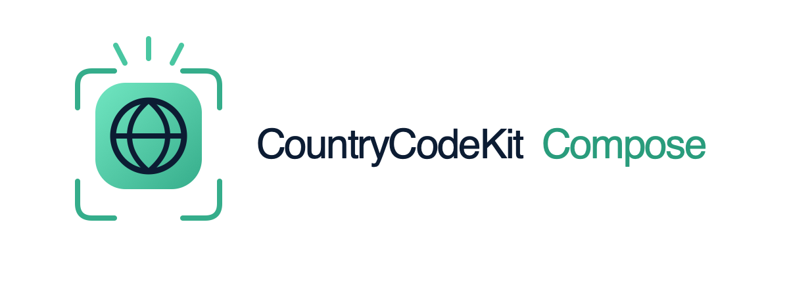
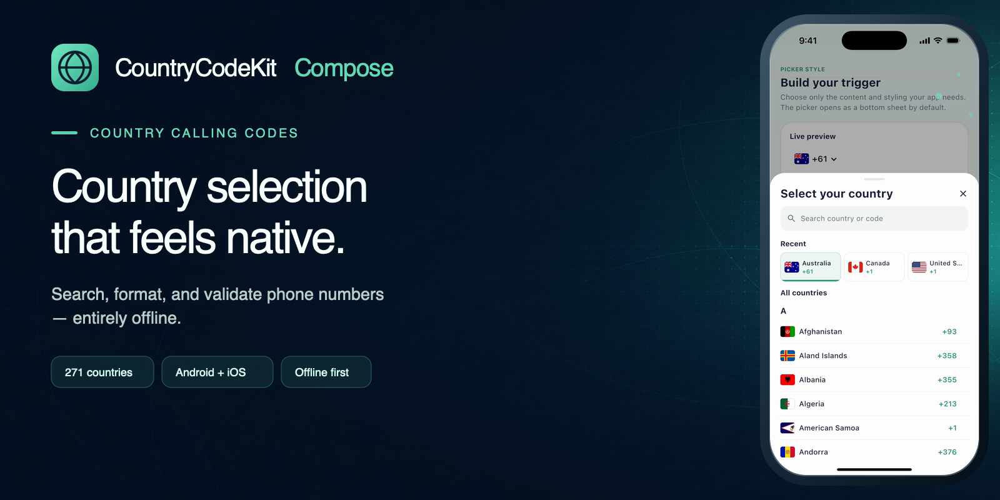
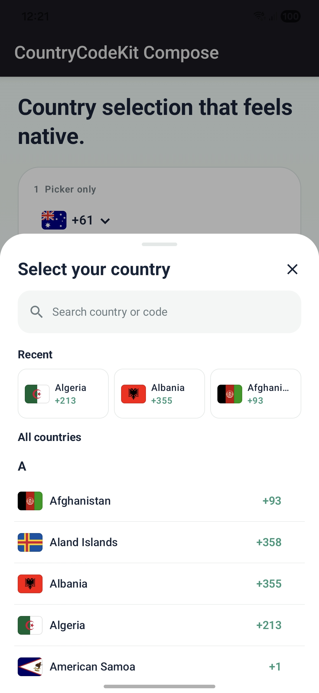
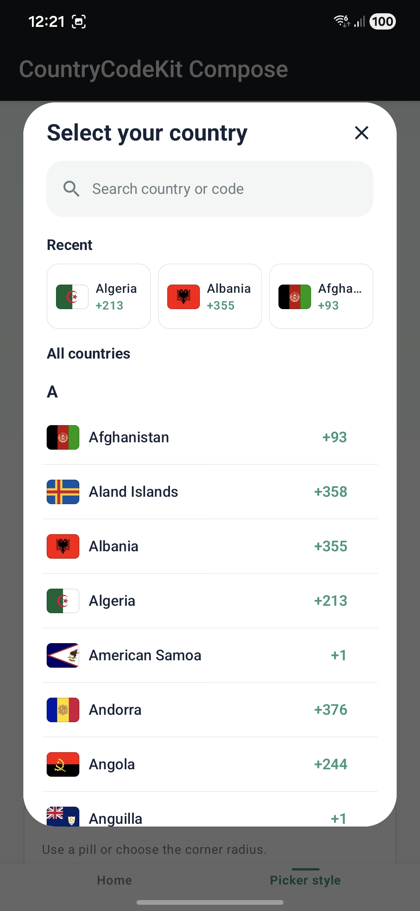
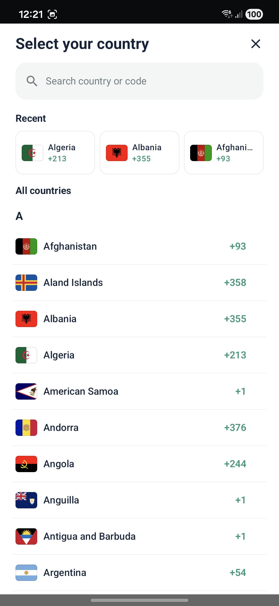

<p align="center">
  <picture>
    <source media="(prefers-color-scheme: dark)" srcset="docs/assets/countrycodekit-logo-lockup-transparent.png" />
    
  </picture>
</p>

<p align="center">
  <a href="https://central.sonatype.com/artifact/io.github.tharukack/countrycodekit"></a>
  
  
  
  
</p>

<p align="center">
  <strong>A polished country calling-code picker for Compose Multiplatform.</strong><br />
  Search countries, display recent selections, browse A–Z sections, format input, and validate phone numbers locally on Android and iOS.
</p>

<p align="center">
  <a href="https://tharukack.github.io/countrycodekit/">Website</a> ·
  <a href="#live-demo">Live Demo</a> ·
  <a href="#features">Features</a> ·
  <a href="#installation">Installation</a> ·
  <a href="#quick-start">Quick Start</a> ·
  <a href="#api-and-customization-reference">API Reference</a> ·
  <a href="#phone-number-validation">Validation</a> ·
  <a href="#platform-support">Platform Support</a>
</p>

<br />

<p align="center">
  
</p>

## Live Demo

<p align="center">
  
</p>

The real iOS sample demonstrates the searchable country picker, bottom-sheet, dialog and full-screen presentations, format-as-you-type phone input, and local Google libphonenumber validation.

<table>
  <tr>
    <th width="33.33%">Bottom sheet</th>
    <th width="33.33%">Dialog</th>
    <th width="33.33%">Full screen</th>
  </tr>
  <tr>
    <td></td>
    <td></td>
    <td></td>
  </tr>
</table>

---

## Features

- Search-first country picker with the search field fixed at the top.
- Responsive recent-selection cards instead of hard-coded popular countries: one fills the row, while two or three divide it evenly.
- Optional alphabetical country sections, enabled by default.
- Clean rows with country flag, full country name, and calling code—no ISO abbreviations.
- Selected-country highlighting and an accessible selection indicator.
- 271 bundled, transparent PNG flags rendered from reviewed `flag-icons` sources.
- Country names, calling codes, parsing, formatting, and validation backed by Google libphonenumber metadata.
- Offline possible/valid checks, E.164 formatting, and international formatting.
- Bottom-sheet, dialog, and full-screen styles.
- Android and iOS targets only.
- No verification service, network request, or external runtime phone-number wrapper.

---

## Installation

Add CountryCodeKit Compose to the Compose Multiplatform source set where the picker is used:

```kotlin
kotlin {
    sourceSets {
        commonMain.dependencies {
            implementation("io.github.tharukack:countrycodekit:1.1.0")
        }
    }
}
```

CountryCodeKit Compose is published to Maven Central. Use the same dependency from shared code for both Android and iOS Compose Multiplatform targets.

---

## Quick Start

The minimal implementation needs only a saveable state and the picker:

```kotlin
val pickerState = rememberCountryCodePickerState()

CountryCodePicker(
    state = pickerState,
)
```

This gives you the default US selection, flag/calling-code/chevron trigger, bottom-sheet presentation, searchable complete catalog, calling codes, up to three recent selections, alphabetical sections, bundled flags, and Material typography and text colors. Selecting a country updates `pickerState.selectedCountry` and closes the picker.

Read the selected value anywhere in your UI:

```kotlin
val selected = pickerState.selectedCountry

Text(selected.name)
Text(selected.formattedCallingCode)
```

To choose the initial country or seed recents when the library has no stored selections yet, provide the country once and use plain ISO codes for recents:

```kotlin
val australia = CountryCodeCatalog.findByIsoCode("AU")!!
val pickerState = rememberCountryCodePickerState(
    initialCountry = australia,
    initialRecentSelections = listOf("AU", "NZ", "US"),
)
```

The three most recent manual selections are shared automatically between picker instances and persisted locally on the device. They survive navigation, picker-state recreation, process termination, and app restarts. Country detection does not add a recent selection, and CountryCodeKit Compose stores only ISO country codes—never phone numbers or other user data.

---

## Fully Customized Implementation

This example uses the default bottom-sheet style as a complete phone-field integration. It shows picker customization together with app-owned text input, cursor-safe as-you-type formatting, full validation, automatic country detection, country filtering, recent selections, and normalized outputs. Keep only the values your application needs.

```kotlin
val australia = CountryCodeCatalog.findByIsoCode("AU")!!

// This is the picker configuration chosen by your app.
val pickerConfig = CountryCodePickerConfig(
    style = CountryCodePickerStyle.BottomSheet,
    countryFilter = CountryCodePickerCountryFilter.Supported(
        isoCodes = listOf("AU", "NZ", "US"),
    ),
    bottomSheet = CountryCodePickerBottomSheetConfig(
        heightFraction = 0.65f,
        gesturesEnabled = false,
        shape = RoundedCornerShape(topStart = 28.dp, topEnd = 28.dp),
        showDragHandle = true,
        dragHandleWidth = 40.dp,
        dragHandleHeight = 4.dp,
        dragHandleTopPadding = 10.dp,
        dragHandleShape = RoundedCornerShape(100.dp),
        borderWidth = 0.dp,
        tonalElevation = 0.dp,
        minWidth = null,
        maxWidth = null,
    ),
    trigger = CountryCodePickerTriggerConfig(
        triggerElements = setOf(
            CountryCodePickerTriggerElement.Flag,
            CountryCodePickerTriggerElement.CountryCode,
            CountryCodePickerTriggerElement.Chevron,
        ),
        flagStyle = CountryCodeFlagStyle.Circle,
        shape = RoundedCornerShape(14.dp),
        borderWidth = 1.dp,
        countryCodeTextStyle = TextStyle(
            fontSize = 16.sp,
            fontWeight = FontWeight.SemiBold,
        ),
        chevronSize = 12.dp,
        startPadding = 9.dp,
        topPadding = 9.dp,
        endPadding = 9.dp,
        bottomPadding = 9.dp,
        elementSpacing = 6.dp,
        colors = CountryCodePickerTriggerColors(
            container = Color.Transparent,
            content = Color.Unspecified,
            chevron = Color.Unspecified,
            border = Color(0xFFDDE7E3),
        ),
    ),
    countryList = CountryCodePickerCountryListConfig(
        showSearch = true,
        showCallingCode = true,
        showRecentSelections = true,
        recentSelectionLimit = 3,
        separateCountriesByLetter = true,
        autoFocusSearch = false,
        flagStyle = CountryCodeFlagStyle.Circle,
        search = CountryCodePickerSearchConfig(
            shape = RoundedCornerShape(14.dp),
            height = 48.dp,
            horizontalPadding = 12.dp,
            iconSize = 19.dp,
            iconSpacing = 8.dp,
            clearButtonSize = 32.dp,
            clearIconSize = 18.dp,
        ),
        selection = CountryCodePickerSelectionConfig(
            rowShape = RoundedCornerShape(10.dp),
            rowBorderWidth = 1.dp,
            rowHorizontalInset = 8.dp,
            rowVerticalInset = 2.dp,
            rowContentStartPadding = 12.dp,
            rowContentEndPadding = 8.dp,
            indicatorSize = 20.dp,
            recentCardShape = RoundedCornerShape(10.dp),
            recentCardBorderWidth = 0.5.dp,
            recentCardSpacing = 6.dp,
            recentContentPadding = 8.dp,
            recentIndicatorHeight = 3.dp,
        ),
        strings = CountryCodePickerStrings(
            title = "Select your country",
            searchPlaceholder = "Search country or code",
            recent = "Recent",
            allCountries = "All countries",
            searchResults = "Search results",
            noResults = "No countries found",
            close = "Close",
            clearSearch = "Clear search",
        ),
        textStyles = CountryCodePickerCountryListTextStyles(
            title = TextStyle(fontWeight = FontWeight.Bold),
            search = TextStyle.Default,
            sectionTitle = TextStyle(fontWeight = FontWeight.Bold),
            letterHeader = TextStyle(fontWeight = FontWeight.Bold),
            countryName = TextStyle.Default,
            callingCode = TextStyle(fontWeight = FontWeight.SemiBold),
            emptyState = TextStyle.Default,
        ),
        colors = CountryCodePickerCountryListColors(
            accent = Color(0xFF46BD99),
            accentStrong = Color(0xFF2F987A),
            sheetContainer = Color.White,
            searchContainer = Color(0xFFF4F6F6),
            selectedContainer = Color(0xFFEEF8F4),
            selectedContent = Color.Unspecified,
            content = Color.Unspecified,
            secondaryContent = Color.Unspecified,
            divider = Color(0xFFE3E9E7),
            containerBorder = Color.Transparent,
            scrim = Color(0x52000000),
        ),
    ),
)

// This optional library state connects the picker with your app-owned phone field.
val phoneState = rememberCountryCodePhoneState(
    initialCountry = australia,
    initialNumber = "",
    initialRecentSelections = listOf("AU", "NZ", "US"),
    formatAsYouType = true,
    // Validate each edit and detect the country from complete international numbers.
    processing = CountryCodePhoneProcessing.ValidateAndDetectCountry,
    // Use full country-aware libphonenumber validation.
    validationPreset = CountryCodePhoneValidationPreset.PhoneNumber,
    pickerConfig = pickerConfig,
)

// This layout and its text field belong to your app.
Column(verticalArrangement = Arrangement.spacedBy(8.dp)) {
    Row(verticalAlignment = Alignment.Top) {
        // CountryCodeKit Compose renders the picker and keeps its selected country in phoneState.
        CountryCodePicker(
            state = phoneState.pickerState,
            config = phoneState.pickerConfig,
        )

        // Your app renders and owns the actual phone-number text field.
        OutlinedTextField(
            value = phoneState.rawNumber,
            onValueChange = phoneState::updateNumber,
            modifier = Modifier.weight(1f),
            placeholder = { Text("Phone number") },
            singleLine = true,
            // Formatting is display-only, so raw input and cursor position remain stable.
            visualTransformation = phoneState.visualTransformation,
            keyboardOptions = KeyboardOptions(
                keyboardType = KeyboardType.Phone,
            ),
            isError = phoneState.rawNumber.isNotEmpty() && !phoneState.isValid,
            supportingText = {
                // Validation contains the latest result returned by CountryCodeKit Compose.
                phoneState.validation?.let { result ->
                    Text(
                        if (result.isValid) "Valid phone number" else result.status.name,
                    )
                }
            },
        )
    }

    // Valid numbers expose ready-to-use normalized formats.
    phoneState.international?.let { Text("International: $it") }
    phoneState.e164?.let { Text("E.164: $it") }
}
```

The `OutlinedTextField` belongs to the application; CountryCodeKit Compose only supplies state and `visualTransformation`. `updateNumber` keeps the stored value unformatted, validates it, and detects the country when a complete valid international number such as `+61…` is entered. The visual transformation adds display-only spacing without input delay or cursor jumps. Detection respects `pickerConfig.countryFilter`, while manual choices become recent selections. Valid results expose both `international` and `e164` values.

`Color.Unspecified` means “use the host Material theme.” This example uses a supported-country filter; use `Unsupported` instead when it is shorter to describe the countries your app must hide. Dialog and full-screen settings are intentionally omitted because the selected style is `BottomSheet`.

### Alternatives Not Shown

The example fully customizes the selected bottom-sheet path and demonstrates the recommended unified phone state. It intentionally leaves out alternatives that replace, disable, or duplicate something already selected:

- `Dialog` and `FullScreen` presentation configuration. Only the configuration matching `style` is used; see [Picker styles and behavior](#picker-styles-and-behavior).
- An `Unsupported` country filter. It is the mutually exclusive alternative to the demonstrated `Supported` filter; see [Restrict countries](#restrict-countries).
- Application-owned flag rendering through `flagContent`. It replaces the bundled rounded or circular flags; see [Custom flags](#custom-flags).
- Lighter phone processing modes: `None`, `Validate`, or `DetectCountry`. The example uses the combined `ValidateAndDetectCountry` mode.
- Other validation presets: possible length, digits only, digits plus possible length, and custom length; see [Phone Number Validation](#phone-number-validation).
- Disabling as-you-type formatting, standalone final formatting, or directly using the lower-level validator; see [Phone Number Formatting](#phone-number-formatting).
- Standard composable controls such as `modifier` and `enabled`, which can be supplied directly to `CountryCodePicker` when required.

---

## API and Customization Reference

The bottom-sheet example above is intentionally detailed. This reference explains the public API by responsibility so normal integrations can configure only what they need.

### API Map

| Area | What you can configure |
| --- | --- |
| [Core picker API](#core-picker-api) | Country data, catalog lookup, picker state, and the picker composable. |
| [Picker styles and behavior](#picker-styles-and-behavior) | Bottom sheet, dialog, full screen, search, recents, sections, and sheet behavior. |
| [Trigger](#trigger) | Choose its elements, flag style, shape, spacing, typography, and colors. |
| [Country list](#country-list) | Search, calling codes, recents, sections, flags, strings, text, shapes, and colors. |
| [Strings](#strings) | Title, search placeholder, section labels, empty state, and accessibility labels. |
| [Country-list colors](#country-list-colors) | Accent, sheet, search, selection, content, divider, and scrim colors. |
| [Countries](#restrict-countries) | Provide either supported or unsupported ISO country codes. |
| [Flags](#custom-flags) | Replace bundled artwork with application-owned flag content. |
| [Phone formatting](#phone-number-formatting) | Unified phone state, raw input, visual formatting, country detection, and final formats. |
| [Phone validation](#phone-number-validation) | Validation presets, result status, and normalized output. |

### Core picker API

```kotlin
val pickerState = rememberCountryCodePickerState(
    initialCountry = CountryCodeCatalog.findByIsoCode("AU")!!,
    initialRecentSelections = listOf("NZ", "US"),
)

CountryCodePicker(
    state = pickerState,
    modifier = Modifier,
    enabled = true,
)
```

| API | Responsibility |
| --- | --- |
| `CountryCode` | Immutable selected-country value containing `isoCode`, `name`, `callingCode`, and `formattedCallingCode`. |
| `CountryCodeCatalog` | Bundled searchable country catalog with `countries`, `findByIsoCode`, `search`, and `hasBundledFlag`. |
| `rememberCountryCodePickerState` | Creates saveable selection, open/closed, and search-query state connected to the library's shared, locally persisted recent selections. Initial recents accept ISO-code strings. |
| `CountryCodePickerState` | Exposes `selectedCountry`, `isOpen`, `query`, and `recentSelections`, plus `open`, `dismiss`, `updateQuery`, and `select`. |
| `CountryCodePicker` | Renders the trigger and selected presentation using the supplied state and optional configuration. |
| `CountryCodePickerConfig` | Groups style, filtering, trigger, country-list, and style-specific configuration. |
| `CountryCodeFlag` | Renders a bundled flag independently when an application needs it outside the picker. |

`CountryCodePicker` requires only `state`. Its optional `modifier` controls placement, `config` controls behavior and appearance, `enabled` controls trigger interaction, and `flagContent` replaces bundled flags in both the trigger and country list.

### Picker styles and behavior

```kotlin
val config = CountryCodePickerConfig(
    style = CountryCodePickerStyle.Dialog,
    dialog = CountryCodePickerDialogConfig(
        height = 560.dp,
        shape = RoundedCornerShape(24.dp),
        maxWidth = 520.dp,
        dismissOnBackPress = true,
        dismissOnClickOutside = true,
    ),
)

CountryCodePicker(
    state = pickerState,
    config = config,
)
```

`BottomSheet` is the default style. `Dialog` presents the same content in a centered container, and `FullScreen` uses the available window. Search matches country names, ISO codes, and calling codes. Recent cards appear after manual selections exist or when initial ISO codes seed an empty stored list.

| Option | Default | Purpose |
| --- | --- | --- |
| `style` | `BottomSheet` | Uses a bottom sheet, dialog, or full-screen style. Omit it to use the default. |
| `countryFilter` | `All` | Accepts one supported or unsupported list of string ISO codes. |
| `trigger` | Default trigger config | Controls trigger elements, shape, border, and colors. |
| `countryList` | Default country-list config | Controls search, calling codes, recents, sections, strings, and country-list colors. |
| `bottomSheet` | Default bottom-sheet config | Used only by the `BottomSheet` style. |
| `dialog` | Default dialog config | Used only by the `Dialog` style. |
| `fullScreen` | Default full-screen config | Used only by the `FullScreen` style. |

#### Bottom sheet

```kotlin
val bottomSheetConfig = CountryCodePickerBottomSheetConfig(
    heightFraction = 0.65f,
    gesturesEnabled = false,
    shape = RoundedCornerShape(topStart = 28.dp, topEnd = 28.dp),
    showDragHandle = true,
    maxWidth = 640.dp,
)
```

`CountryCodePickerBottomSheetConfig` controls height fraction, sheet gestures, top-corner shape, drag-handle visibility/size/padding/shape, outer-border width, tonal elevation, and optional minimum/maximum width. Its defaults preserve the original `0.65f` height, disabled gestures, 28 dp top corners, 40 × 4 dp handle, zero border/elevation, and platform-managed width.

#### Dialog

```kotlin
val dialogConfig = CountryCodePickerDialogConfig(
    height = 560.dp,
    shape = RoundedCornerShape(24.dp),
    borderWidth = 1.dp,
    maxWidth = 520.dp,
    dismissOnClickOutside = true,
)
```

`CountryCodePickerDialogConfig` controls height, shape, outer-border width, tonal and shadow elevation, optional minimum/maximum width, back dismissal, and outside-click dismissal. Its defaults preserve the 620 dp height, 28 dp corners, zero border/elevation, platform-managed width, and standard dismissal behavior.

#### Full screen

```kotlin
val fullScreenConfig = CountryCodePickerFullScreenConfig(
    contentMaxWidth = 720.dp,
    useStatusBarPadding = true,
    useNavigationBarPadding = true,
    dismissOnBackPress = true,
)
```

`CountryCodePickerFullScreenConfig` controls optional minimum/maximum content width, status-bar padding, navigation-bar padding, and back dismissal. The full-screen surface itself always fills the window; width limits center the picker content inside it, which is useful on tablets. Defaults preserve full-width content with status-bar padding.

### Country List

```kotlin
val countryListConfig = CountryCodePickerCountryListConfig(
    showSearch = true,
    showCallingCode = true,
    showRecentSelections = true,
    recentSelectionLimit = 3,
    separateCountriesByLetter = true,
    autoFocusSearch = false,
    flagStyle = CountryCodeFlagStyle.Rounded,
)
```

`CountryCodePickerCountryListConfig` owns everything rendered inside the selected presentation: search, calling-code visibility, recent cards, alphabetical sections, search focus, list flag style, strings, text styles, search shape, selection shape, and colors. The library remembers and displays up to three manual selections across picker instances and app restarts.

Set `separateCountriesByLetter = false` for one continuous list. `showSearch`, `showCallingCode`, and `showRecentSelections` independently control the corresponding list features. `recentSelectionLimit` is constrained to the responsive recent-card capacity of three.

#### Strings

```kotlin
val strings = CountryCodePickerStrings(
    title = "Choose a country",
    searchPlaceholder = "Search name or calling code",
    recent = "Recently selected",
    allCountries = "Countries",
    noResults = "No matching countries",
)
```

`CountryCodePickerStrings` contains all user-facing and accessibility copy: `title`, `searchPlaceholder`, `recent`, `allCountries`, `searchResults`, `noResults`, `close`, and `clearSearch`. Replace these values for localization or product language; none are hard-coded outside this object.

#### Country-list text styles

```kotlin
val textStyles = CountryCodePickerCountryListTextStyles(
    title = TextStyle(fontSize = 22.sp, fontWeight = FontWeight.Bold),
    countryName = TextStyle(fontSize = 15.sp),
    callingCode = TextStyle(fontWeight = FontWeight.SemiBold),
)
```

`CountryCodePickerCountryListTextStyles` provides optional overrides for `title`, `search`, `sectionTitle`, `letterHeader`, `countryName`, `callingCode`, and `emptyState`. Each override merges with the corresponding host `MaterialTheme` typography, so unspecified font properties continue to come from the application. Primary and selected text use `MaterialTheme.colorScheme.onSurface`; secondary text uses `onSurfaceVariant` unless explicit country-list colors are supplied.

#### Search box

```kotlin
val searchConfig = CountryCodePickerSearchConfig(
    shape = RoundedCornerShape(16.dp),
    height = 48.dp,
    horizontalPadding = 12.dp,
    iconSize = 19.dp,
    clearButtonSize = 32.dp,
)
```

`CountryCodePickerSearchConfig` controls the search field without replacing its behavior.

| Option | Default | Purpose |
| --- | --- | --- |
| `shape` | 14 dp rounded | Search container shape. |
| `height` | `48.dp` | Search container height. |
| `horizontalPadding` | `12.dp` | Internal start and end padding. |
| `iconSize` | `19.dp` | Search icon size. |
| `iconSpacing` | `8.dp` | Space between the icon and text. |
| `clearButtonSize` | `32.dp` | Clear-button touch area. |
| `clearIconSize` | `18.dp` | Clear icon size. |

#### Selection boxes

```kotlin
val selectionConfig = CountryCodePickerSelectionConfig(
    rowShape = RoundedCornerShape(10.dp),
    rowBorderWidth = 1.dp,
    rowVerticalInset = 2.dp,
    recentCardShape = RoundedCornerShape(10.dp),
    recentCardSpacing = 6.dp,
    recentIndicatorHeight = 3.dp,
)
```

`CountryCodePickerSelectionConfig` controls both selected country rows and recent cards. Row options cover shape, border width, horizontal/vertical inset, content padding, and indicator size. Recent-card options cover shape, border width, spacing, content padding, and bottom-indicator height. Their colors remain in `CountryCodePickerCountryListColors`: `selectedContainer`, `selectedContent`, `accentStrong`, and `divider`.

#### Country-list colors

```kotlin
val countryListColors = CountryCodePickerCountryListColors(
    accent = Color(0xFF46BD99),
    accentStrong = Color(0xFF2F987A),
    sheetContainer = MaterialTheme.colorScheme.surface,
    content = MaterialTheme.colorScheme.onSurface,
    secondaryContent = MaterialTheme.colorScheme.onSurfaceVariant,
    containerBorder = MaterialTheme.colorScheme.outlineVariant,
)
```

CountryCodeKit Compose ships with a white country-list surface, soft-neutral search field, accessible mint selection colors, and Material-inherited text colors. All country-list colors belong inside `CountryCodePickerCountryListConfig`.

| Color | Default | Purpose |
| --- | --- | --- |
| `accent` | `#46BD99` | Primary visual accent. |
| `accentStrong` | `#2F987A` | Calling codes and the selection indicator. |
| `sheetContainer` | `#FFFFFF` | Sheet, dialog, full-screen, and ordinary row background. |
| `searchContainer` | `#F4F6F6` | Filled search field background. |
| `selectedContainer` | `#EEF8F4` | Selected-country row background. |
| `selectedContent` | Material `onSurface` | Selected-country name. |
| `content` | Material `onSurface` | Primary text, icons, and letter labels. |
| `secondaryContent` | Material `onSurfaceVariant` | Search icons, placeholders, and empty-state text. |
| `divider` | `#E3E9E7` | Inset row dividers and the sheet drag handle. |
| `containerBorder` | Transparent | Outer border used by bottom-sheet and dialog styles when their border width is greater than zero. |
| `scrim` | 32% black | Background dimming behind the sheet. |

### Restrict countries

```kotlin
val config = CountryCodePickerConfig(
    countryFilter = CountryCodePickerCountryFilter.Supported(
        isoCodes = listOf("AU", "NZ", "US"),
    ),
)
```

`countryFilter` accepts exactly one policy. Use `CountryCodePickerCountryFilter.Supported(isoCodes)` to show only those countries, `Unsupported(isoCodes)` to hide those countries, or `All` for the complete catalog. ISO codes are case-insensitive and unknown values are ignored. The same filter is used by automatic phone-number country detection when the shared phone state receives this picker configuration.

### Custom flags

```kotlin
CountryCodePicker(
    state = pickerState,
    flagContent = { country ->
        AppFlag(isoCode = country.isoCode)
    },
)
```

`Rounded` flags are the default. Set `flagStyle` to `Circle` independently in the trigger and country-list configurations. Use the composable's `flagContent` slot to replace bundled PNGs in both locations, or use `CountryCodeFlag` as a standalone composable. Custom countries without bundled artwork receive a compact ISO fallback inside the flag area; ordinary country rows never show ISO abbreviations.

### Trigger

```kotlin
val triggerConfig = CountryCodePickerTriggerConfig(
    triggerElements = setOf(
        CountryCodePickerTriggerElement.Flag,
        CountryCodePickerTriggerElement.CountryCode,
    ),
    flagStyle = CountryCodeFlagStyle.Circle,
    shape = RoundedCornerShape(14.dp),
    borderWidth = 1.dp,
    countryCodeTextStyle = TextStyle(fontSize = 16.sp),
    chevronSize = 12.dp,
    elementSpacing = 6.dp,
    colors = CountryCodePickerTriggerColors(
        container = Color.Transparent,
        content = MaterialTheme.colorScheme.onSurface,
        border = MaterialTheme.colorScheme.outlineVariant,
    ),
)
```

`CountryCodePickerTriggerConfig` controls which elements appear (`Flag`, `CountryCode`, and `Chevron`), flag style, shape, border width, country-code text style, chevron size, four independent padding edges, and spacing between elements. Its `colors` object controls the container, text, chevron, and border. The container and border are transparent by default. Trigger typography merges with `MaterialTheme.typography.bodyMedium`; text defaults to `onSurface`, and the chevron follows the resolved text color unless separately overridden.

### Phone Number Formatting

```kotlin
val national = CountryCodePhoneFormatter.format(
    number = "0412345678",
    country = pickerState.selectedCountry,
    format = CountryCodePhoneFormat.National,
)

val international = CountryCodePhoneFormatter.format(
    number = "0412345678",
    country = pickerState.selectedCountry,
    format = CountryCodePhoneFormat.International,
)
```

CountryCodeKit Compose provides standalone formatters that work with any app-owned text field.

Available final formats are `National`, `International`, `E164`, and `Rfc3966`. Invalid input or an unsupported region is returned unchanged.

`CountryCodePhoneFormatter.normalizeInput` keeps only a leading `+` and decimal digits for stable raw state. `format` produces a final value using either a `CountryCode` or ISO region, while `formatAsYouType` returns an immediately formatted string for non-text-field use. For editable fields, prefer `CountryCodePhoneVisualTransformation` or the unified state's `visualTransformation` so formatting never changes the stored raw value.

The Fully Customized Implementation above demonstrates the recommended `CountryCodePhoneState` integration. It coordinates the raw number, display formatting, validation, detection, and picker state while the application continues to render and own its text field. By default it enables cursor-safe as-you-type formatting, full phone validation, and country detection. Detection updates the picker only for a complete, valid international number beginning with `+`; national numbers retain the selected country. Automatic matches respect the configured country filter and are not added to recent selections.

| Phone-state API | Responsibility |
| --- | --- |
| `rawNumber` | Normalized unformatted value to bind to the application text field. |
| `updateNumber(input)` | Normalizes input and runs the selected validation/detection processing. |
| `visualTransformation` | Cursor-aware, display-only country formatting for the application text field. |
| `formatAsYouType` | Mutable switch controlling whether the visual transformation is active. |
| `pickerState` / `pickerConfig` | Shared picker selection and configuration used by rendering and detection. |
| `selectedCountry` | Currently selected or automatically detected country. |
| `validation` / `isValid` | Latest optional validation result and convenience validity value. |
| `international` / `e164` | Ready-to-use normalized formats when validation succeeds. |

| Processing mode | Behavior |
| --- | --- |
| `None` | Stores normalized raw input without validation or detection. |
| `Validate` | Validates against the selected country without changing it. |
| `DetectCountry` | Detects complete valid international numbers without producing a validation result. |
| `ValidateAndDetectCountry` | Performs both operations and is the default. |

Choose lighter processing when needed:

```kotlin
val phoneState = rememberCountryCodePhoneState(
    processing = CountryCodePhoneProcessing.Validate, // or None, DetectCountry
    validationPreset = CountryCodePhoneValidationPreset.PhoneNumber,
    pickerConfig = CountryCodePickerConfig(
        countryFilter = CountryCodePickerCountryFilter.Supported(
            listOf("AU", "NZ", "US"),
        ),
    ),
    formatAsYouType = true,
)
```

`pickerConfig` is the single source of truth for both the visible picker list and automatic detection. Pass `phoneState.pickerConfig` to `CountryCodePicker`; a detected country outside its filter will never replace the selection.

Do not call `formatAsYouType()` and save its formatted result into raw field state. Use `phoneState.visualTransformation` for immediate formatting without delays or cursor jumps. It keeps inserted spaces display-only and preserves cursor mapping.

For custom state management, bind the lower-level validator once and pass each changing number to the required operation:

```kotlin
val phone = CountryCodePhoneValidator(
    pickerState = pickerState,
    preset = CountryCodePhoneValidationPreset.PhoneNumber,
    countryFilter = config.countryFilter,
)

val validationOnly = phone.validate(rawInput)
val detectedCountryOnly = phone.detectCountry(rawInput)
val validationAndDetection = phone.validateAndDetectCountry(rawInput)
```

`validate()` never changes the picker. The two detection operations update it only for a complete, valid international number beginning with `+`, respect supported or unsupported country filters, and do not add automatic matches to recent user selections. National numbers retain the existing country because they cannot be identified reliably.

### Phone Number Validation

```kotlin
val result = CountryCodePhoneValidator.validate(
    number = phoneNumber,
    country = pickerState.selectedCountry,
    preset = CountryCodePhoneValidationPreset.PhoneNumber,
)

when (result.status) {
    CountryCodePhoneStatus.VALID -> println(result.e164)
    CountryCodePhoneStatus.IMPOSSIBLE -> println("Impossible number length")
    CountryCodePhoneStatus.INVALID -> println("Invalid phone number")
    else -> Unit
}
```

CountryCodeKit Compose validates locally with its maintained Kotlin Multiplatform port of Google libphonenumber.

Choose only the validation level your app needs:

| Preset | Behavior |
| --- | --- |
| `PhoneNumber` | Full country-aware libphonenumber validation; this remains the default. |
| `PossibleLength` | Accepts numbers with a possible length for the selected country, without requiring an assigned number pattern. |
| `DigitsOnly` | Accepts ASCII digits only and does not require a valid country. |
| `DigitsAndPossibleLength` | Requires digits only plus a possible length for the selected country. |
| `CustomLength(range, digitsOnly)` | Checks your own digit-count range and can optionally reject formatting characters. |

```kotlin
val result = CountryCodePhoneValidator.validate(
    number = phoneNumber,
    country = pickerState.selectedCountry,
    preset = CountryCodePhoneValidationPreset.CustomLength(
        range = 7..12,
        digitsOnly = true,
    ),
)
```

`CountryCodePhoneResult` can provide:

- `status`
- `e164`
- `international`
- `normalizedDigits`
- `detectedCountry`
- `isValid`

`status` is one of `EMPTY`, `INVALID_REGION`, `NOT_A_NUMBER`, `NON_DIGIT_CHARACTERS`, `TOO_SHORT`, `TOO_LONG`, `IMPOSSIBLE`, `INVALID`, or `VALID`.

This is structural phone-number validation, not ownership verification. CountryCodeKit Compose does not send SMS messages, place calls, or contact a verification service.

---

## Platform Support

| Platform | Status | Target |
| --- | --- | --- |
| Android | Supported | Kotlin/Android library and sample APK |
| iOS devices | Supported | `iosArm64` static framework |
| iOS simulator | Supported | `iosSimulatorArm64` static framework |

CountryCodeKit Compose does not publish desktop, standalone JVM, web, watchOS, tvOS, Linux, or Windows targets.

---

## Run the Sample and Tests

Build the Android sample and run the shared tests/framework checks:

```shell
./gradlew :sample:composeApp:assembleDebug
./gradlew iosSimulatorArm64Test
./gradlew linkDebugFrameworkIosSimulatorArm64
```

For iOS, open `sample/iosApp/CountryCodeKitSample.xcodeproj` in Xcode and run the `CountryCodeKitSample` scheme on an iPhone simulator or device. Xcode builds and embeds the shared Compose framework automatically.

The sample demonstrates every picker style and live validation. The test suite checks the complete country metadata set, bundled flag coverage, shared calling codes, search, recents, optional alphabetical sections, picker state, phone validation, and Compose interactions.

---

## Data Sources and Updates

[`UPSTREAMS.properties`](UPSTREAMS.properties) records the exact upstream revisions used by each release:

- [Google libphonenumber](https://github.com/google/libphonenumber) for calling codes, parsing, formatting, and validation metadata under Apache License 2.0.
- [flag-icons](https://github.com/lipis/flag-icons) for SVG flag artwork under the MIT License. CountryCodeKit Compose converts reviewed source artwork into Android/iOS-compatible PNG resources.
- [libphonenumber-kotlin](https://github.com/luca992/libphonenumber-kotlin) as the original Kotlin port baseline under Apache License 2.0.

Run the sync scripts against reviewed local upstream checkouts, update the pins, run the complete suite, and publish a new CountryCodeKit Compose version. A weekly workflow checks whether pinned sources have advanced. Vendored-source changes must never be shipped silently in an existing artifact version.

See [`third_party/`](third_party/) for complete notices and provenance.

---

## License

CountryCodeKit Compose is available under the [MIT License](LICENSE). Bundled third-party data, source ports, and artwork retain their respective licenses described in the third-party notice directories.
